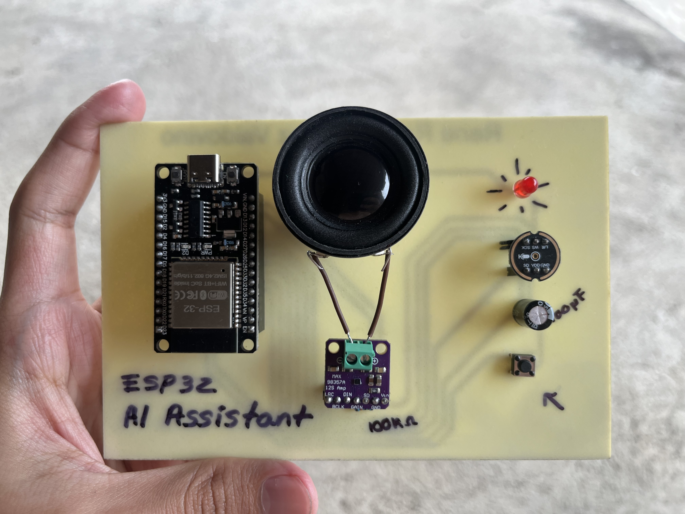

# ESP32 AI Assistant

An open-source voice assistant that combines an ESP32 device with a local AI backend. Speech is captured on the ESP32, transcribed with Whisper, processed by Groq, and played back through a speaker using text-to-speech.



## Features

* Real-time voice capture on ESP32
* On-device energy-based Voice Activity Detection (VAD)
* Whisper speech-to-text transcription
* Groq-powered conversational AI
* WebSocket communication (binary ESP32 to server, text server to ESP32)
* Google TTS audio playback via ESP32-audioI2S library
* Local/self-hosted Python backend
* Push-button toggle interaction

## Hardware

* ESP32 DevKit
* INMP441 I2S MEMS microphone
* MAX98357A I2S DAC amplifier
* 4 ohm 3W speaker
* Push button (GPIO17)
* LED indicator (GPIO15)

Pin assignments in [./include/config.h](./include/config.h).

## Architecture

```text
┌─────────────────────────┐
│         ESP32           │
│                         │
│  INMP441 Mic            │
│  VAD Detection          │
│  Audio Streaming        │
│  Google TTS             │
│  MAX98357A Speaker      │
└────────────┬────────────┘
             │
             │ WebSocket
             │ binary: AUDIO / VOICE_START / VOICE_END
             │ text: TTS response fragments
             │
┌────────────▼────────────┐
│     Python Server       │
│                         │
│  Whisper STT            │
│  Groq LLM               │
│  Text response          │
└─────────────────────────┘
```

## How It Works

1. Press the button to start listening.
2. Speak into the microphone.
3. The ESP32 captures audio and uses energy-based VAD to detect speech.
4. Audio chunks are sent to the Python server over WebSocket as binary messages.
5. Whisper transcribes the speech to text.
6. The transcription is sent to Groq for response generation.
7. The response text is sent back to the ESP32 as a WebSocket text frame.
8. The ESP32 fetches Google TTS audio via `connecttospeech("en")` and plays it through the speaker.

## Installation

### Server

```bash
python -m venv .venv
.venv\Scripts\activate
pip install -r requirements.txt

cp .env.example .env # Add your GROQ_API_KEY, optionally set LLM or Whisper model

python -m server.server
```

`.env` variables:

|Variable|Default|Description|
|:---|:---|:---|
|`GROQ_API_KEY`|—|Groq API key (required)|
|`LLM_MODEL`|`groq/compound`|Groq model name|
|`SERVER_WS_PORT`|`8765`|WebSocket server port|
|`WHISPER_MODEL`|`base`|faster-whisper model size|
|`WHISPER_DEVICE`|`cpu`|Device for Whisper|
|`WHISPER_COMPUTE_TYPE`|`int8`|Compute precision|

### ESP32

```bash
cp include/secrets.h.example include/secrets.h

# Configure in secrets.h:
# WIFI_SSID "your-network-name"
# WIFI_PASSWORD "your-password"
# SERVER_IP 192.168.1.100
# WS_PORT 8765

pio run -t upload
```

>[!IMPORTANT]
>`SERVER_IP` must not be quoted. It is stringified at compile time via `#define STRINGIFY(x) #x`.

## Usage

* Press the button to start listening.
* The LED turns on while recording.
* Speak normally.
* After 1.5 seconds of silence, the request is processed automatically.
* Press the button again at any time to cancel.

## Configuration

Voice Activity Detection parameters can be tuned in [./include/config.h](./include/config.h):

|Parameter|Description|
|:---|:---|
|`VAD_ENERGY_THRESHOLD`|Lower values detect quieter speech, higher values reject more background noise|
|`SILENCE_TIMEOUT_MS`|Time to wait after speech ends before sending audio for processing|

## Communication Protocol

### ESP32 to Server

Binary messages with a 5-byte header:

```text
[1 byte type][4 byte big-endian length][payload]
```

|Value|Description|
|:---|:---|
|`0x01`|PCM audio data (16-bit, 16 kHz, mono)|
|`0x02`|Control text (`VOICE_START`, `VOICE_END`)|

### Server to ESP32

Raw WebSocket text frames containing response fragments. The ESP32 plays them via `audio.connecttospeech(text, "en")`.

## License

MIT License. See [LICENSE](./LICENSE) for details.