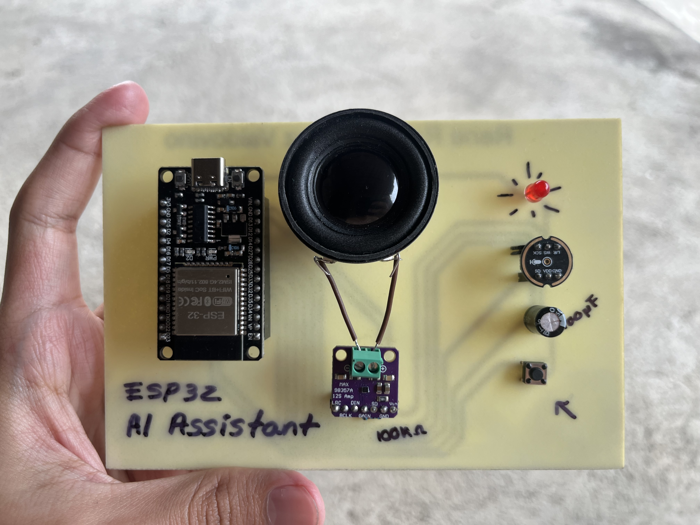

# ESP32 AI Assistant

An ESP32 captures your voice, a local Python backend transcribes it using Whisper, generates responses with the Groq LLM you configure, and plays them through either your computer or the ESP32’s speaker.



## Features

- Push-button toggle with debounce.
- Energy-based VAD with pre-roll.
- English or Spanish supported, selected with `LANGUAGE`.
- TTS on your computer (edge-tts) or ESP32 speaker (Google TTS), with fallback.
- WebSocket link: binary frames one way, text frames the other.

## Hardware

You need:

- ESP32.
- INMP441 microphone.
- MAX98357A amplifier.
- 3W speaker.
- Push button.
- LED.

We also use a 100 uF capacitor between VCC and GND on the microphone, and a resistor between the amp GAIN pin and GND.

The pin numbers used by the firmware are in [include/pins.h](include/pins.h). Before flashing, connect every component to the same pins listed there.

## Prerequisites

- Python 3 and the venv module.
- PlatformIO CLI.
- mpv or ffplay installed if you want playback on your computer.

## Installation

### Server

1. Create and activate a virtual environment:

```
python3 -m venv .venv
source .venv/bin/activate
```

2. Install the dependencies:

```
pip install -r requirements.txt
```

3. Create the .env file from the example:

```
cp .env.example .env
```

4. Open .env and set `GROQ_API_KEY`. You can also change the language, the model, the playback target and more. Each option is explained in the file and in the Configuration section below.

5. Start the server:

```
python -m server.server
```

The server prints what it is doing on the console and waits for the ESP32 to connect.

### ESP32

1. Create secrets.h from the example:

```
cp include/secrets.h.example include/secrets.h
```

2. Open include/secrets.h and fill in your WiFi network and the server address:

- `WIFI_SSID`: your network name.
- `WIFI_PASSWORD`: your network password.
- `SERVER_IP`: the address of the computer running the server. Do not put quotes around it.

3. Make sure your wiring matches the pins in include/pins.h (microphone, amplifier, button and LED).

4. Build and flash:

```
pio run -t upload
```

The firmware shows READY on the serial monitor when it connects to WiFi and the server. You can open the serial monitor with the following command:

```
pio device monitor
```

## Configuration

There are three places to configure:

- server/.env: server options. Copy it from [.env.example](.env.example) and edit the values you need. Main options:

  - `GROQ_API_KEY`: required.
  - `LLM_MODEL`: which Groq model to use.
  - `LANGUAGE`: en or es.
  - `PLAYBACK_TARGET`: computer (edge-tts on your computer) or esp32 (ESP32 speaker).
  - `WHISPER_MODEL`, `WHISPER_DEVICE`, `WHISPER_COMPUTE_TYPE`.
  - `TTS_SERVER_VOICE`, `TTS_SERVER_RATE`.

- include/secrets.h: WiFi name, password and server IP. Copy it from [include/secrets.h.example](include/secrets.h.example).
- include/config.h: firmware tuning such as voice detection. include/pins.h has the pin numbers.

## Protocol

The ESP32 sends binary frames with a 5 byte header: type (1 byte), length (4 bytes, big endian), then payload.

- Type 0x01: PCM audio, 16-bit, 16 kHz, mono
- Type 0x02: control text (VOICE_START or VOICE_END)

The server sends plain text frames:

- Frames starting with [log] are printed but not spoken.
- Frames starting with LANG: set the TTS language.
- Any other frame is spoken on the ESP32 speaker.

## Usage

Press the button to start listening. Speak. The reply is played after 1.5 seconds of silence. Press the button again to stop early.

See the server console for the transcript and the answer.

## Tuning speech detection

If the assistant misses quiet speech, lower `VAD_ENERGY_THRESHOLD` in [include/config.h](include/config.h). If it starts while you are not talking, raise it. `SILENCE_TIMEOUT_MS` sets how long after speaking the session ends.

## License

MIT License. See [LICENSE](./LICENSE) for more details.
